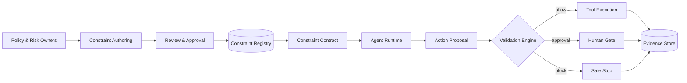

# Reference Architecture

## Architectural layers

1. **Governance layer** — ownership, policy interpretation, approval, exception, and review.
2. **Control layer** — registry, contracts, validators, compatibility analysis, and decision logic.
3. **Execution layer** — agents, orchestration, tools, data stores, and external services.
4. **Evidence layer** — logs, decisions, versions, exceptions, and audit records.
