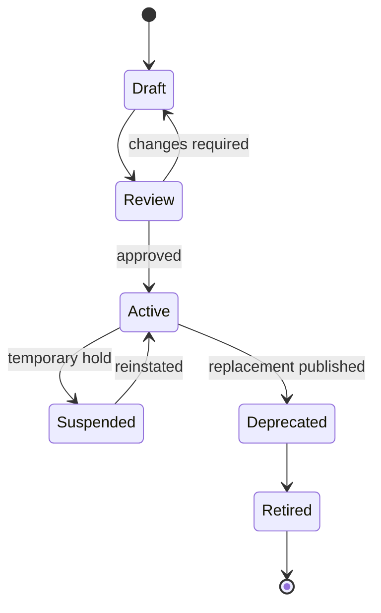

# Constraint Lifecycle

Each transition should capture the actor, timestamp, rationale, and associated approval evidence. Runtime systems must not use draft or retired constraints unless an explicit test environment permits it.
